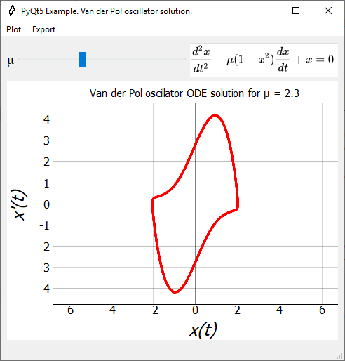

## Van der Pol oscillator
Solution of [Van der Pol oscillator](https://en.wikipedia.org/wiki/Van_der_Pol_oscillator) equation by new scipy/solve_ivp method with parameters. Trajectory and phase plot.

