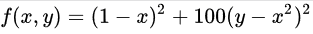

## Minimization Rosenbrock
[Rosenbrock function](https://en.wikipedia.org/wiki/Rosenbrock_function) minimization (scipy/optimize). You can toggle the different methods and set initial condition by double click on Contour plot.

